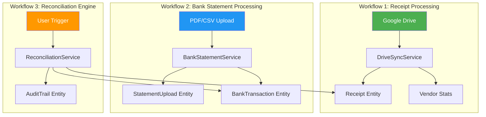

# Architectural Audit: Time-Decoupled Financial Workflow System

## Executive Summary

This audit evaluates the FinSight system against a **time-decoupled workflow architecture** with three independent processes: Receipt Processing, Bank Statement Processing, and Reconciliation Engine. The system is architecturally sound at its core but has several gaps that need attention before production readiness.

**Overall Readiness: MVP+ → approaching Production**

---

## 1. ✅ What Is Already Correct

### A. Receipt Processing (Google Drive Sync)
| Criteria | Status | Evidence |
|---|---|---|
| Incremental & Idempotent | ✅ | [DriveSyncServiceImpl.java](file:///Users/uttamkumar_barik/Documents/Antigravity/java/finsight-backend/src/main/java/com/finsight/backend/service/impl/DriveSyncServiceImpl.java#L102-L107) — skips if `driveFileId` or `contentHash` already exists |
| Processes only new data | ✅ | Checks both `driveFileId` and `md5Checksum` before processing |
| Independent from bank processing | ✅ | `DriveSyncServiceImpl` has zero references to `BankStatementService` or `ReconciliationService` |
| Own lifecycle & status | ✅ | `SyncStatus` tracked in a per-tenant `ConcurrentHashMap` |
| Async execution | ✅ | Uses `CompletableFuture.runAsync()` |

### B. Bank Statement Processing
| Criteria | Status | Evidence |
|---|---|---|
| Batch-oriented | ✅ | Processes entire PDF/CSV files as batch, extracting all transactions |
| Stores data independently | ✅ | `BankTransaction` entity is separate from `Receipt` |
| Persistent storage | ✅ | Files saved to `/app-data/uploads/{tenantId}/{fileId}.ext` |
| File-level idempotency | ✅ | SHA-256 hash check skips `COMPLETED` files, allows `FAILED` retries |
| Transaction-level dedup | ✅ | `referenceNumber` hash (`date|amount|description`) prevents duplicate rows |
| Retry & dead-letter | ✅ | `retryCount` → `FAILED_PERMANENT` after 3 failures |
| Metrics tracking | ✅ | `avgConfidenceScore`, `geminiCallsCount`, `processingTimeMs` on `StatementUpload` |
| Reprocess API | ✅ | `POST /statements/uploads/{fileId}/reprocess` |

### C. Reconciliation Engine
| Criteria | Status | Evidence |
|---|---|---|
| User-triggered | ✅ | `POST /api/v1/reconciliation/run` and `POST /api/v1/statements/reconcile` — both explicit user actions |
| Operates on stored data | ✅ | [ReconciliationServiceImpl](file:///Users/uttamkumar_barik/Documents/Antigravity/java/finsight-backend/src/main/java/com/finsight/backend/service/impl/ReconciliationServiceImpl.java#L42-L43) queries only persisted `BankTransaction` records |
| Idempotent audit trails | ✅ | `existsByTransactionIdAndIssueTypeAndResolvedFalse()` prevents duplicate audit entries |
| Manual override support | ✅ | `manuallyLink()`, `markAsNoReceiptNeeded()` with audit trail resolution |
| Scoring algorithm | ✅ | Amount (50pts), Date proximity (30pts), Vendor similarity via Levenshtein (20pts) |

### D. Data Model Separation
| Entity | Purpose | Status |
|---|---|---|
| `Receipt` | OCR-extracted receipt data | ✅ Independent |
| `BankTransaction` | Parsed bank statement rows | ✅ Independent |
| `StatementUpload` | File-level metadata & metrics | ✅ Independent |
| `AuditTrail` | Reconciliation findings | ✅ Independent |

---

## 2. ⚠️ Identified Gaps

### GAP-1: Controller-Level Coupling (HIGH)

**What**: [BankStatementController](file:///Users/uttamkumar_barik/Documents/Antigravity/java/finsight-backend/src/main/java/com/finsight/backend/controller/BankStatementController.java#L33) injects `ReconciliationService` and exposes `POST /statements/reconcile`.

**Why it violates workflow model**: Reconciliation is an independent workflow. Embedding its trigger inside the Bank Statement controller creates a false dependency, suggesting that reconciliation is a step in statement processing.

**Severity**: ⚠️ **HIGH** — Architectural principle violation.

```java
// Current: BankStatementController.java
private final ReconciliationService reconciliationService; // ← violates SRP

@PostMapping("/reconcile")  // ← should be in ReconciliationController
public ResponseEntity<?> triggerManualReconciliation(...)
```

---

### GAP-2: ReconciliationStatus Enum Too Limited (MEDIUM)

**What**: [ReconciliationStatus](file:///Users/uttamkumar_barik/Documents/Antigravity/java/finsight-backend/src/main/java/com/finsight/backend/entity/ReconciliationStatus.java) has only 2 values: `MATCHED`, `MANUAL_REVIEW`.

**Why it violates workflow model**: Missing lifecycle states: `UNMATCHED`, `PENDING`, `NO_RECEIPT_REQUIRED`, `DISPUTED`. The `matchType` field on `BankTransaction` partially compensates (e.g., `NO_RECEIPT_REQUIRED`), but this is inconsistent.

**Severity**: ⚠️ **MEDIUM** — Data model gap.

```java
// Current
public enum ReconciliationStatus { MATCHED, MANUAL_REVIEW }

// Expected
public enum ReconciliationStatus {
    PENDING,              // Not yet reconciled
    MATCHED,              // Auto or manual match
    UNMATCHED,            // No candidate found
    NO_RECEIPT_REQUIRED,  // Explicitly marked
    MANUAL_REVIEW,        // Needs human attention
    DISPUTED              // User rejected a match
}
```

---

### GAP-3: No Dedicated ReconciliationResult Entity (MEDIUM)

**What**: Reconciliation results are written directly into `BankTransaction` fields (`reconciled`, `receipt`, `matchScore`, `matchType`) and `AuditTrail`, but there's no standalone `ReconciliationResult` (or `ReconciliationRun`) entity.

**Why it violates workflow model**: Each reconciliation run should be a first-class entity with: `runId`, `tenantId`, `accountType`, `runTimestamp`, `matchedCount`, `unmatchedCount`, `status`. Without this, you cannot answer: "When was the last reconciliation? What were the results?"

**Severity**: ⚠️ **MEDIUM** — Audit trail gap.

---

### GAP-4: `BankTransaction.reconciled` Boolean Redundant (LOW)

**What**: `BankTransaction` has both a `reconciled` boolean field AND a `reconciliationStatus` enum. Some queries use `reconciled`, others use `reconciliationStatus`.

**Why**: This dual-state creates data integrity risk. If `reconciliationStatus = MATCHED` but `reconciled = false`, the system is inconsistent.

**Severity**: ⚠️ **LOW** — Code smell, but functional.

---

### GAP-5: Receipt Processing Lacks Persistent Status Tracking (MEDIUM)

**What**: `DriveSyncServiceImpl` tracks sync status only in-memory (`ConcurrentHashMap<String, SyncStatus>`). If the server restarts mid-sync, all progress is lost.

**Why it violates workflow model**: An independent workflow needs its own lifecycle persistence (like `StatementUpload` does for bank statements).

**Severity**: ⚠️ **MEDIUM** — Operational resilience gap.

---

### GAP-6: Unsafe Thread Usage in ReceiptServiceImpl (LOW)

**What**: [ReceiptServiceImpl.updateReceipt()](file:///Users/uttamkumar_barik/Documents/Antigravity/java/finsight-backend/src/main/java/com/finsight/backend/service/impl/ReceiptServiceImpl.java#L66) uses `new Thread(() -> {...}).start()` for background training data harvesting.

**Why**: Raw threads bypass Spring's thread pool management, error handling, and async configuration. This should use `@Async` or `CompletableFuture`.

**Severity**: ⚠️ **LOW** — Works but not production-grade.

---

### GAP-7: `getRecentUploads()` Returns All Tenants (LOW)

**What**: [BankStatementService.getRecentUploads()](file:///Users/uttamkumar_barik/Documents/Antigravity/java/finsight-backend/src/main/java/com/finsight/backend/service/BankStatementService.java#L288-L291) accepts `tenantId` but returns `statementUploadRepository.findAll()`.

**Why**: Tenant isolation violation. In a multi-tenant system, this leaks data across tenants.

**Severity**: ⚠️ **LOW** — Bug (easy fix).

---

### GAP-8: No Reconciliation Lock / Concurrency Guard (LOW)

**What**: `ReconciliationServiceImpl.runReconciliation()` has no guard against concurrent execution. Two users hitting "Reconcile" simultaneously could create conflicting matches.

**Severity**: ⚠️ **LOW** — Edge case for single-tenant system, but important for multi-tenant.

---

## 3. 🔧 Recommended Fixes

### Fix 1: Move Reconciliation Trigger Out of BankStatementController (HIGH PRIORITY)

Remove the `/reconcile` endpoint and `ReconciliationService` dependency from `BankStatementController`. The existing `ReconciliationController` already has `POST /reconciliation/run` which is the correct endpoint.

```diff
// BankStatementController.java
- private final ReconciliationService reconciliationService;
- @PostMapping("/reconcile") ...

// Frontend: update API call from /statements/reconcile → /reconciliation/run
```

> [!IMPORTANT]
> This is a **breaking API change** for the frontend. The `StatementsPage.tsx` must update its "AUTO RECONCILE" button to call `/api/v1/reconciliation/run` instead of `/api/v1/statements/reconcile`.

---

### Fix 2: Expand ReconciliationStatus Enum (MEDIUM PRIORITY)

```java
public enum ReconciliationStatus {
    PENDING,
    MATCHED,
    UNMATCHED,
    NO_RECEIPT_REQUIRED,
    MANUAL_REVIEW,
    DISPUTED
}
```

Migration: existing `MANUAL_REVIEW` rows remain valid. New rows default to `PENDING`. Update `markAsNoReceiptNeeded()` to use `NO_RECEIPT_REQUIRED` instead of `MATCHED`.

---

### Fix 3: Add ReconciliationRun Entity (MEDIUM PRIORITY)

```java
@Entity
public class ReconciliationRun {
    @Id @GeneratedValue private Long id;
    private String tenantId;
    private String accountType;
    private LocalDateTime startedAt;
    private LocalDateTime completedAt;
    private Integer matchedCount;
    private Integer unmatchedCount;
    private Integer manualReviewCount;
    private String status; // RUNNING, COMPLETED, FAILED
}
```

Each call to `runReconciliation()` creates a new run record, providing a full history.

---

### Fix 4: Deprecate `reconciled` Boolean (LOW PRIORITY)

- Stop writing to `BankTransaction.reconciled`
- Replace all queries using `reconciled` with queries using `reconciliationStatus`
- Add a database migration to sync existing data: `UPDATE bank_transactions SET reconciliation_status = 'MATCHED' WHERE reconciled = true`
- Eventually drop the `reconciled` column

---

### Fix 5: Add Persistent Receipt Sync Tracking (MEDIUM PRIORITY)

Create a `ReceiptSyncRun` entity similar to `StatementUpload`:

```java
@Entity
public class ReceiptSyncRun {
    @Id @GeneratedValue private Long id;
    private String tenantId;
    private LocalDateTime startedAt;
    private LocalDateTime completedAt;
    private Integer processedCount;
    private Integer skippedCount;
    private Integer failedCount;
    private String status; // RUNNING, COMPLETED, FAILED
}
```

---

### Fix 6: Replace Raw Thread with @Async (LOW PRIORITY)

```diff
// ReceiptServiceImpl.java
- new Thread(() -> { ... }).start();
+ CompletableFuture.runAsync(() -> { ... });
// Or better: extract to a @Async method in a separate service
```

---

### Fix 7: Fix Tenant Isolation Bug (LOW PRIORITY)

```diff
// BankStatementService.java
public List<StatementUpload> getRecentUploads(String tenantId) {
-   return statementUploadRepository.findAll();
+   return statementUploadRepository.findByTenantIdOrderByCreatedAtDesc(tenantId);
}
```

---

## 4. 🧠 Architecture Summary



### Current vs Expected

| Aspect | Current | Expected | Gap |
|---|---|---|---|
| Workflow Independence | 90% | 100% | `/statements/reconcile` creates false coupling |
| Data Persistence | ✅ Centralized | ✅ Centralized | — |
| Reconciliation Trigger | User-triggered ✅ | User-triggered ✅ | — |
| Lifecycle States | Partial | Complete | `ReconciliationStatus` too limited |
| Idempotency | ✅ Strong | ✅ Strong | — |
| Run History | ❌ Missing | Per-run tracking | No `ReconciliationRun` entity |
| Retryability | ✅ Statement | ✅ All workflows | Receipt sync not retryable at file level |
| Auditability | ✅ AuditTrail | ✅ Full history | Missing reconciliation run log |

---

## 5. 🚀 Readiness Level

| Level | Status | Notes |
|---|---|---|
| **MVP** | ✅ Achieved | All 3 workflows functional, basic idempotency |
| **Production** | ⚠️ 80% | Needs: controller decoupling, status enum expansion, tenant isolation fix |
| **Scalable** | ❌ 50% | Needs: persistent sync tracking, reconciliation run history, concurrency guards |

### Priority Roadmap

| Priority | Fix | Effort | Impact |
|---|---|---|---|
| P0 | Move `/reconcile` to `ReconciliationController` | 30 min | Architectural correctness |
| P0 | Fix tenant isolation in `getRecentUploads()` | 5 min | Security/data leak |
| P1 | Expand `ReconciliationStatus` enum | 1 hr | Data model completeness |
| P1 | Add `ReconciliationRun` entity | 2 hrs | Audit trail completeness |
| P2 | Add `ReceiptSyncRun` entity | 2 hrs | Operational resilience |
| P2 | Deprecate `reconciled` boolean | 1 hr | Data model consistency |
| P3 | Replace raw threads with `@Async` | 15 min | Code quality |
| P3 | Add reconciliation concurrency guard | 30 min | Multi-tenant safety |
