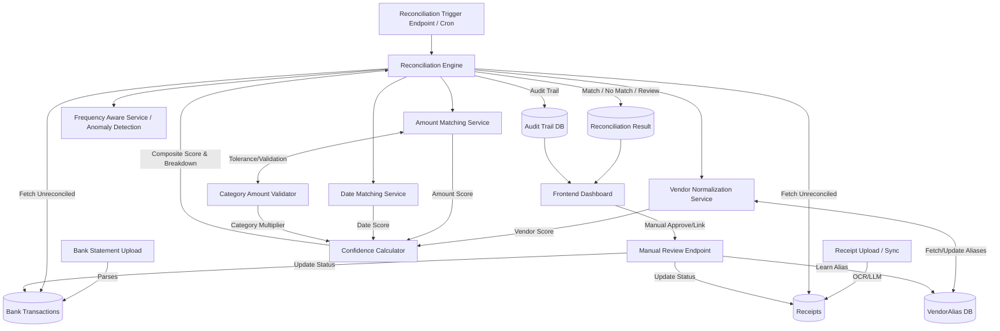

# FinSight Reconciliation Engine - Data Flow & End-to-End Scenario

This document details the data flow of the newly implemented robust reconciliation engine and provides an end-to-end scenario of how it operates in the FinSight platform.

## 1. High-Level Data Flow Diagram (DFD)

## 2. Component Interaction & Architecture

The monolithic reconciliation process has been decoupled into highly specialized components:

1.  **Vendor Normalization Service**: Cleanses raw bank descriptions (e.g., "POS*AMAZON MKTPL") and compares them to receipt vendor names (e.g., "Amazon.com"). It uses exact matching, fuzzy matching (Levenshtein distance), and importantly, checks the `VendorAlias` repository for historically learned mappings.
2.  **Amount Matching Service**: Compares the bank transaction amount against the receipt total. It incorporates `CategorySpecificMatchingRules` to allow dynamic tolerances (e.g., a 2% variance is acceptable for a "Utility" bill due to convenience fees, but 0% for "Rent").
3.  **Date Matching Service**: Evaluates the temporal proximity between the transaction date and the receipt date. A receipt dated exactly on the transaction date gets a perfect score, while a receipt dated 3 days prior might get a partial score based on decay curves.
4.  **Confidence Calculator**: Ingests the individual scores from the Vendor, Amount, and Date services, applies weightings, and outputs a final composite confidence score out of 100 (or 110 with bonuses). It also generates the rationale breakdown.
5.  **Category Amount Validator & Frequency Aware Service**: Acts as a safety net. It flags anomalies where an amount is wildly outside historical norms for that category, or if duplicate payments are detected in the same billing cycle.

## 3. End-to-End Scenario: The "Utility Bill with Convenience Fee"

Let's walk through how the new engine handles a common, complex scenario.

### Step 1: Ingestion
- **Receipt**: The user uploads a PDF bill from "BESCOM" (Bangalore Electricity Supply Company). The OCR engine extracts:
  - Vendor: `BESCOM`
  - Amount: `₹1,500.00`
  - Date: `2023-10-25`
  - Category: `Utilities`
- **Bank Statement**: The bank CSV is parsed and contains:
  - Description: `UPI/3298472938/BILLDESK/BESCOM-BLR/PAYMENT`
  - Amount: `₹1,515.00` (Includes a ₹15 platform fee)
  - Date: `2023-10-26`

### Step 2: Reconciliation Trigger
The system runs the daily reconciliation cron job, picking up the unlinked BESCOM receipt and the corresponding bank transaction.

### Step 3: Sub-Service Evaluation
The `ReconciliationServiceImpl` routes the pair through the modular engine:

1.  **Vendor Normalization (`Vendor Score: 90/100`)**:
    - The service cleans the bank description to "BILLDESK BESCOM BLR".
    - It compares this to "BESCOM". Fuzzy matching detects "BESCOM" as a strong substring.
    - *Learning Kick-in*: If a user previously manually linked these two strings, a `VendorAlias` exists, instantly boosting the score to 100/100. Let's assume this is the first time, so it scores a 90 based on substring overlap.
2.  **Amount Matching (`Amount Score: 95/100`)**:
    - Bank: ₹1,515.00 vs Receipt: ₹1,500.00. Difference: ₹15 (1%).
    - The `CategorySpecificMatchingRules` sees the category is "Utilities". The rules state that Utilities allow up to a 2% variance for gateway fees.
    - Because it falls within the acceptable category tolerance, it scores highly (95/100) instead of failing the match completely.
3.  **Date Matching (`Date Score: 85/100`)**:
    - Bank Date (26th) vs Receipt Date (25th). Difference: 1 day.
    - A 1-day delay is standard for ACH/UPI processing. The decay curve assigns a score of 85.

### Step 4: Confidence Calculation & Validation
- The `ConfidenceCalculator` weights the scores (e.g., Amount is weighted heaviest, then Date, then Vendor).
- Final Composite Score: **92/100**.
- The `CategoryAmountValidator` checks if ₹1,500 is normal for BESCOM. Historical data shows average bills are ₹1,200 - ₹1,800. Status: Passed.
- The `FrequencyAwareService` checks if another ₹1,515 BESCOM payment happened in late October. None found. Status: Passed.

### Step 5: Result & Audit Trail
- Because the score (92) is > the auto-match threshold (90), the system automatically links the receipt to the transaction.
- An `AuditTrail` record is created storing the JSON breakdown: `{"vendorScore": 90, "amountScore": 95, "dateScore": 85, "varianceReason": "Utility fee tolerance applied"}`.

### Step 6: User Interface
- The user logs into the FinSight dashboard.
- On the Statements page, they see the transaction marked with a green `[Linked]` badge.
- Hovering over the badge reveals the new granular breakdown tooltip:
  - *Amount Match: High (₹15 variance allowed for Utilities)*
  - *Date Match: Good (1 day difference)*
  - *Vendor Match: Strong*

### Step 7: The "Manual Review" Learning Loop (Alternative Outcome)
*If the score had been 88 (just below threshold):*
- It would appear in the "Needs Review" queue.
- The user clicks "Confirm Match".
- **The Magic Happens**: The `manuallyLink` endpoint is called. It links the records AND invokes the `VendorNormalizationService.learnAlias()`.
- A new row is inserted into the `vendor_aliases` table: `bank_string="BILLDESK/BESCOM-BLR"`, `receipt_vendor="BESCOM"`, `approval_count=1`.
- Next month, when this bill comes again, the Vendor Score will automatically be 100/100, pushing the composite score over 90 for auto-matching. The system gets smarter with every manual action.